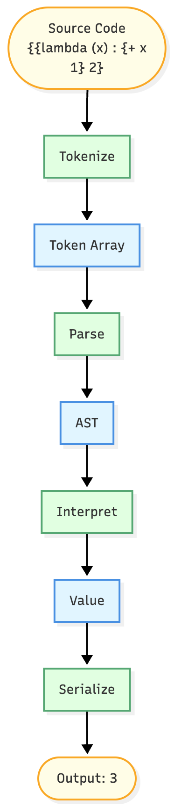

# Overview

When you run `./sheq4 '{{lambda (x) : {+ x 1} 2}'`, you get `3`. Here's how the interpreter works.



The interpreter is a pipeline with four stages.

## Pipeline Stages

**Tokenize** breaks the source string into tokens. The string `{{lambda (x) : {+ x 1} 2}` becomes an array of tokens like `LBRACE`, `LAMBDA`, `ID("x")`, `NUMBER(2)`.

**Parse** builds a tree from tokens. The parser recognizes patterns. When it sees LAMBDA, it expects parameter names, then a colon, then a body.

**Interp** walks the AST and computes values. When it hits a lambda node, it creates a closure. When it hits an application node, it evaluates the function and arguments, then applies them.

**Serialize** converts the final Value back to a string. NumV holding `3.0` becomes `"3"`.

I separated these into distinct stages. I tried combining parse and eval once and the code got messy fast. Keeping them separate means each stage has one job.

## Why This Architecture in C

In C, you can't just pass around syntax objects like in Racket. Everything needs explicit memory management and data structures. Tokenizing first means the parser works with a simple array instead of managing character-by-character state. The AST is a proper C struct with a tagged union, not an s-expression. Values are another tagged union that the interpreter allocates in the arena.

Each stage passes pointers to the next stage. Tokenize returns a TokenStream pointer. Parse takes that and returns an ASTNode pointer. Interp takes the AST and returns a Value pointer. Clean handoffs.

## Program Entry Point

```c
int top_interp(const char *src) {
    Arena *arena = arena_create(1024 * 1024);
    TokenStream *ts = tokenize(arena, src);
    if (!ts) { arena_destroy(arena); return 1; }

    Parser parser = {ts, arena};
    ASTNode *ast = parse_expr(&parser);
    if (!ast) { arena_destroy(arena); return 1; }

    Env *env = make_top_env(arena);
    Value *val = interp(ast, env, arena);
    if (!val) { arena_destroy(arena); return 1; }

    char *out = serialize(val);
    printf("%s\n", out);
    free(out);
    arena_destroy(arena);
    return 0;
}
```

From the previous assignment, you already wrote this. The interesting architectural choices are how each stage is structured internally and how data flows between them. The arena handles all allocations except for the final serialized string, which uses malloc because it needs to outlive the arena cleanup. Each stage either succeeds with a valid pointer or fails with NULL, making error propagation explicit.
