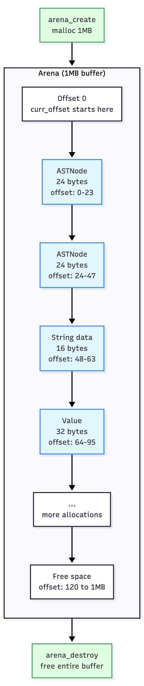

# Memory Management

I use an arena allocator instead of malloc. One big buffer upfront, carve chunks out of it, free everything at once.



## How It Works

The arena is a struct with three fields:

```c
typedef struct Arena {
    unsigned char *buf;
    size_t buf_len;
    size_t curr_offset;
} Arena;
```

When the arena gets created, it mallocs once:

```c
Arena *arena = arena_create(1024 * 1024);
```

This allocates a 1MB buffer. That's the only malloc during setup.

When allocating from the arena:

```c
ASTNode *node = arena_alloc(arena, sizeof(ASTNode));
```

The arena returns `buf + curr_offset`, then bumps `curr_offset` by the size (aligned to 8 bytes). Just pointer arithmetic.

When done:

```c
arena_destroy(arena);
```

One free call. Everything disappears.

## Why 8-Byte Alignment

Some CPUs crash or slow down if you access an 8-byte value at an odd address. The arena aligns every allocation to 8 bytes:

```c
size_t align_up(size_t size, size_t align) {
    return ((size + align - 1) / align) * align;
}
```

If you ask for 13 bytes with 8-byte alignment, you get 16. If you ask for 24, you get 24.

## Why Not malloc

With traditional malloc, every single object needs this:

```c
ASTNode *node = malloc(sizeof(ASTNode));
if (!node) {
    fprintf(stderr, "out of memory\n");
    exit(1);
}

node->type = NODE_NUMC;
node->as.num_val = 17;

free(node);
```

In the interpreter, hundreds of objects get allocated per expression. That's hundreds of malloc calls, hundreds of free calls, hundreds of null checks. I tried this early on and the code was cluttered.

With arena:

```c
ASTNode *node = arena_alloc(arena, sizeof(ASTNode));
if (!node) return NULL;

node->type = NODE_NUMC;
node->as.num_val = 17;
```

No explicit free. At the end, one call to `arena_destroy` cleans up everything.

## Tradeoff

Arena allocation is fast but individual objects can't be freed. If 1000 nodes get allocated and only 10 are needed, the other 990 stick around until the arena gets destroyed.

For an interpreter that runs one expression and exits, this doesn't matter. Parse, evaluate, print, and destroy. The whole lifecycle is milliseconds.

I know that SHEQ4's main purpose isn't garbage collection but C forces us to address memory management, so I went with the simplest approach. The focus here is on the parse and interp parts of the C implementation.

## Memory Lifecycle

Walking through a complete run shows how this all connects. When you run `./sheq4 '{+ 2 3}'`:

The arena gets created with 1MB. Tokenization allocates a tokens array. Parsing allocates AST nodes. The top environment creation allocates bindings. Interpretation allocates Values. Serialization uses a static buffer and `strdup`. After printing, the strdup'd string gets freed and the arena gets destroyed.

One malloc at the start, one free at the end. Everything in between comes from the arena.

---

**Next:** [Data Structures](04-data-structures.md)
