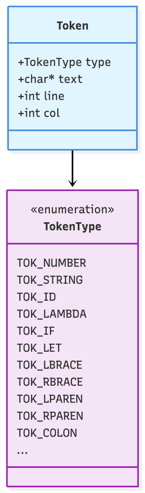
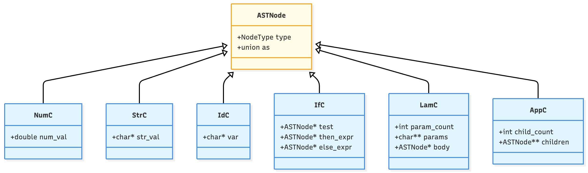

# Data Structures

The interpreter uses four main structures: Token, ASTNode, Value, and Env.

## Token



```c
typedef struct {
    TokenType type;
    char *text;
    int line;
    int col;
} Token;
```

The lexer produces these. When it sees `lambda`, it creates type `TOK_LAMBDA` with text `"lambda"`. When it sees `17`, it creates type `TOK_NUMBER` with text `"17"`.

The line and column are for error messages.

## ASTNode



```c
struct ASTNode {
    NodeType type;
    union {
        double num_val;
        char *str_val;
        char *var;
        struct {
            struct ASTNode *test;
            struct ASTNode *then_expr;
            struct ASTNode *else_expr;
        } if_node;
        struct {
            int param_count;
            char **params;
            struct ASTNode *body;
        } lam_node;
        struct {
            int child_count;
            struct ASTNode **children;
        } app_node;
    } as;
};
```

The `type` field tells you which node it is. The `as` union holds the data for that type. In Racket we'd use something like `u` for the union accessor, but here `as` made more sense because it reads naturally:

```c
node->as.num_val
node->as.if_node
node->as.lam_node
```

"The node as a number" or "the node as a lambda."

## Tagged Union in C

C's tagged union pattern uses a `type` field that explicitly tags which variant is active. The union shares memory between all variants, so an ASTNode is just big enough to hold the largest variant. NumC nodes don't waste space on unused if_node or lam_node fields.

## Value


```c
struct Value {
    ValueType type;
    union {
        double num;
        struct {
            char *data;
            size_t len;
        } str;
        int boolval;
        struct {
            int param_count;
            char **params;
            ASTNode *body;
            Env *env;
        } clos;
        PrimFn prim;
    } as;
};
```

Values are runtime data. NumV holds a number, StrV holds a string, ClosV holds a closure, PrimV holds a primitive function.

The `as` union works the same as in ASTNode. `type` tells you which field is valid.

## Closures in C

From class, you already know what closures are. In this C implementation, the ClosV struct explicitly stores what gets captured. When evaluating a LamC node, the interpreter creates a ClosV that holds pointers to the parameter array, body AST, and the current environment pointer.

```c
struct {
    int param_count;
    char **params;      // array of parameter names
    ASTNode *body;      // pointer to body AST
    Env *env;           // captured environment
} clos;
```

Later, when applying the closure, the interpreter extends that captured environment pointer with new bindings and evaluates the body. The key C-specific detail is that everything is explicit pointers. The environment doesn't get copied, just the pointer to it.

## Env

```c
typedef struct Binding {
    char *name;
    Value val;
    struct Binding *next;
} Binding;

struct Env {
    Binding *bindings;
    Env *parent;
};
```

From class, you know how environments work. In C, I implemented them as linked lists of bindings with a parent pointer. Looking up a name walks the binding list, and if not found, follows the parent pointer.

Example:

```c
{ + -> PrimV(prim_add), true -> BoolV(1) }
    parent
{ x -> NumV(2) }
```

Looking up `x` finds it locally. Looking up `+` checks locally, doesn't find it, follows the parent pointer, finds it there.

The C-specific detail is that extending an environment allocates a new Env struct in the arena with a parent pointer to the old environment. No copying. When the arena gets destroyed, all the Env structs get freed at once.

## Buffers

Some functions need temporary space. `serialize()` uses a static buffer:

```c
static char buf[4096];
```

It's static so it doesn't get allocated on every call. It sits in global memory and gets reused.

I chose 4KB because that's enough for any SHEQ4 value. Numbers serialize to at most 20 characters. Strings get truncated after 4000 characters. Closures just serialize to `"#<procedure>"`.

The function writes into the buffer, then calls `strdup()` to copy it. The caller gets a heap-allocated string.

## Building a Tree

Here's how an AST for `{+ 2 3}` gets built:

```c
ASTNode *two = make_num(arena, 2);
ASTNode *three = make_num(arena, 3);
ASTNode *plus = make_id(arena, "+");

ASTNode *args[] = {two, three};
ASTNode *app = make_app(arena, plus, 2, args);
```

Now `app` points to an AppC node with three children: `plus`, `two`, `three`.
