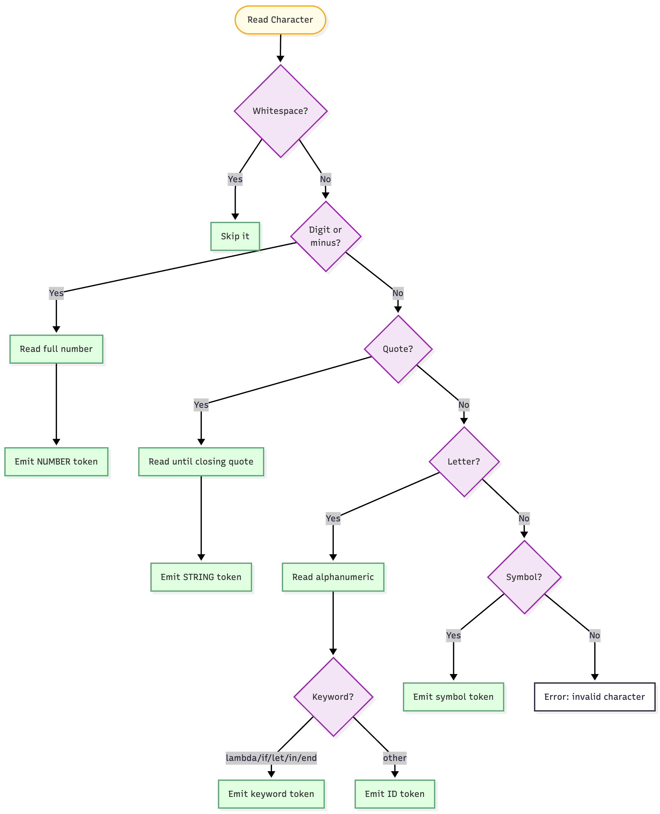
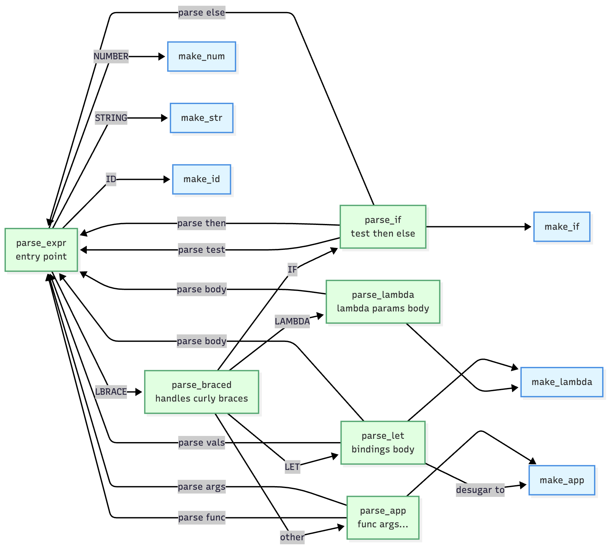

# Parsing

Parsing turns the source string into an AST. It happens in two phases: tokenization, then tree building.

## Why Tokenize First

I tried parsing straight from the source once. It didn't go well. The code was constantly juggling character-level questions ("is this a digit? is this whitespace? does this start a keyword?") while also trying to recognize grammar patterns. Too much at once.

Tokenization splits that work. The lexer handles character-level decisions. The parser handles structure. This separation also lets you recurse cleanly, similar to what we did in Racket. Made the code way more readable.

## Tokenization Logic



The lexer walks the source string character by character. At each character, it decides what to do.

Whitespace gets skipped. Digits or minus start a number (read until non-digit). A quote starts a string (read until closing quote, handling escapes). Letters start an identifier (read alphanumeric, then check if it's a keyword like `lambda`). Symbols like `{` and `(` become their token types.

### Example

For `{{lambda (x) : {+ x 1} 2}`:

```
{      -> LBRACE
{      -> LBRACE
lambda -> LAMBDA
(      -> LPAREN
x      -> ID("x")
)      -> RPAREN
:      -> COLON
{      -> LBRACE
+      -> ID("+")
x      -> ID("x")
1      -> NUMBER("1")
}      -> RBRACE
}      -> RBRACE
2      -> NUMBER("2")
}      -> RBRACE
```

Operators like `+` are just identifiers in SHEQ4. The lexer doesn't special-case them.

## Parser Helpers

Four helper functions navigate the token stream.

```c
Token peek(Parser *parser) {
    return parser->ts->tokens[parser->ts->current];
}
```

**peek** looks at the current token without advancing.

```c
Token advance(Parser *parser) {
    if (parser->ts->current < parser->ts->count - 1)
        parser->ts->current++;
    return parser->ts->tokens[parser->ts->current - 1];
}
```

**advance** returns the current token and moves forward.

```c
int match(Parser *parser, TokenType type) {
    if (peek(parser).type == type) {
        advance(parser);
        return 1;
    }
    return 0;
}
```

**match** checks if current token matches a type. If yes, advance and return true.

```c
Token expect(Parser *parser, TokenType type, const char *msg) {
    Token tok = peek(parser);
    if (tok.type != type) {
        fprintf(stderr, "SHEQ: %s at line %d col %d\n", msg, tok.line, tok.col);
        return (Token){TOK_ERROR, NULL, tok.line, tok.col};
    }
    return advance(parser);
}
```

**expect** is for required tokens. If it doesn't match, error.

These helpers keep the parsing functions cleaner. Instead of manually indexing into the token array everywhere, you call `peek()` or `advance()`.

## How Parsing Works



The parser uses recursive descent. Each grammar rule gets its own function.

**parse_expr** is the entry point. It looks at the current token. NUMBER calls `make_num`. STRING calls `make_str`. ID calls `make_id`. LBRACE calls `parse_braced`.

**parse_braced** handles `{ ... }`. It peeks at the token after the opening brace. LAMBDA calls `parse_lambda`. IF calls `parse_if`. LET calls `parse_let`. Otherwise it assumes you're applying a function and calls `parse_app` to collect arguments.

**parse_lambda** expects `(`, collects parameter names until `)`, expects `:`, then recursively calls `parse_expr` to parse the body.

**parse_app** collects arguments by repeatedly calling `parse_expr` until it sees `}`.

The functions call each other as needed. When `parse_lambda` needs to parse the body, it calls `parse_expr`. When `parse_app` needs to parse an argument, it calls `parse_expr`. The recursion handles nesting naturally.

## Why Multiple Parse Functions

I could write one giant `parse()` function with a big switch statement. Tried that early on. The function got huge and confusing fast. Each grammar construct has different rules. Lambdas collect parameter lists. If expressions expect three sub-expressions. Let bindings collect name/value pairs.

Separate functions keep each rule isolated. When you read `parse_lambda`, you only see lambda logic. When you read `parse_if`, you only see if logic. Easier to debug and modify.

## Let Desugaring in C

From class, you already know that let desugars into lambda application. Here's how it works in the C implementation.

```c
{let {[x = 5]} in {+ x 3} end}
```

Becomes:

```c
{{lambda (x) : {+ x 3}} 5}
```

When `parse_let` runs, it allocates arrays for the parameter names and binding values. It builds a LamC node with those parameters and the body. Then it wraps that LamC in an AppC node with the binding values as arguments. All the nodes get allocated from the arena.

```c
// Simplified version of what parse_let does
char **params = arena_alloc(arena, count * sizeof(char*));
ASTNode **vals = arena_alloc(arena, count * sizeof(ASTNode*));

// ... collect bindings into params and vals arrays ...

ASTNode *lam = make_lambda(arena, param_count, params, body);
ASTNode *app = make_app(arena, lam, param_count, vals);
```

The C-specific detail is managing those arrays. The parser needs to allocate space for the parameter names, collect the values into another array, then pass both arrays to the node construction functions. This was part of the assignment requirements. The interpreter doesn't need a separate case for let since lambda application already handles it.

## Building the Tree

Walking through `{+ 2 3}` shows how the pieces connect.

`parse_expr` sees LBRACE, calls `parse_braced`. `parse_braced` sees ID("+"), not a keyword, so it parses an application. It calls `parse_expr` on "+", which returns `make_id("+")`. It calls `parse_app` with that IdC node. `parse_app` loops, calling `parse_expr` for each argument. It gets NumC(2) and NumC(3). It builds an AppC node with three children.

Result:

```
AppC
├── IdC("+")
├── NumC(2)
└── NumC(3)
```

---

**Next:** [Evaluation](06-evaluation.md)
