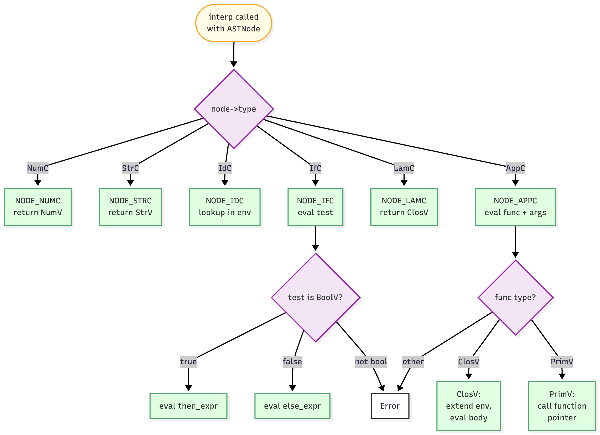

# Evaluation

The interpreter walks the AST and produces values.

## How Interp Works



The interpreter takes an ASTNode and an environment, then switches on the node type.

**NumC** returns a NumV with the number:

```c
case NODE_NUMC:
    out->type = VAL_NUMV;
    out->as.num = node->as.num_val;
    return out;
```

**StrC** returns a StrV with the string. The string data gets copied into the arena.

**IdC** looks up the identifier in the environment:

```c
case NODE_IDC: {
    Value *val = lookup(env, node->as.var);
    if (!val) {
        fprintf(stderr, "SHEQ: unbound: %s\n", node->as.var);
        return NULL;
    }
    return val;
}
```

**IfC** evaluates the test. If it's true, evaluate then_expr. Otherwise evaluate else_expr:

```c
case NODE_IFC: {
    Value *test_val = interp(node->as.if_node.test, env, arena);
    if (!test_val) return NULL;
    if (!check_type(test_val, VAL_BOOLV, "if")) return NULL;
    return test_val->as.boolval
        ? interp(node->as.if_node.then_expr, env, arena)
        : interp(node->as.if_node.else_expr, env, arena);
}
```

**LamC** creates a closure that captures the current environment:

```c
case NODE_LAMC:
    out->type = VAL_CLOSV;
    out->as.clos.param_count = node->as.lam_node.param_count;
    out->as.clos.params = node->as.lam_node.params;
    out->as.clos.body = node->as.lam_node.body;
    out->as.clos.env = env;
    return out;
```

**AppC** evaluates the function and arguments, then applies.

## Lambda Application in C

From class, you already know how lambda application and closures work. Here's how the C implementation handles it.


When evaluating a LamC node, the interpreter allocates a Value struct from the arena and copies pointers from the AST node into the ClosV. No deep copying. The `params` pointer points to the same array that's in the LamC node. The `body` pointer points to the same AST. The `env` pointer captures whatever environment pointer was passed to interp.

```c
out->as.clos.params = node->as.lam_node.params;  // copy pointer
out->as.clos.body = node->as.lam_node.body;      // copy pointer
out->as.clos.env = env;                          // copy pointer
```

I could deep copy the params array or the body AST, but that would waste arena space. Since the AST nodes live in the arena for the entire program run, sharing pointers is safe and efficient.

When evaluating an AppC node, the interpreter recursively calls interp on the function and each argument. This produces a ClosV pointer and an array of Value pointers.

To apply the closure, the interpreter allocates a new Env struct in the arena. This new environment's bindings link parameter names to argument values. The parent pointer gets set to the closure's captured environment pointer, not the current environment pointer.

```c
Env *new_env = arena_alloc(arena, sizeof(Env));
new_env->bindings = /* create bindings from params and args */;
new_env->parent = clos->env;  // use captured env, not current env
```

Then interp gets called recursively on the closure's body with this new environment. The body AST pointer and new env pointer get passed in.

### Example with C Details

For `{{lambda (x) : {+ x 1} 2}`, walking through the pointers shows how it works.

Evaluating the LamC allocates a Value in the arena. The ClosV gets three pointers copied into it. The `params` pointer points to an array containing one string pointer to "x". The `body` pointer points to an AppC node in the arena. The `env` pointer points to top_env.

```c
// After evaluating LamC
ClosV: {
    param_count: 1,
    params: -> ["x"],
    body: -> AppC(IdC("+"), [IdC("x"), NumC(1)]),
    env: -> top_env
}
```

Evaluating the AppC recurses on the function (getting the ClosV pointer) and the argument (getting a NumV pointer containing 2.0).

Applying the closure allocates a new Env struct. One Binding struct gets allocated linking "x" to the NumV(2). The new_env parent pointer gets set to the ClosV's env pointer (top_env).

```c
// Memory layout after extending environment
new_env -> Env {
    bindings -> Binding { name: "x", val: NumV(2), next: NULL },
    parent -> top_env
}
```

Now interp gets called with the body pointer and new_env pointer. The body is an AppC calling `+` with `x` and `1`.

Looking up `+` walks new_env's bindings (doesn't find it), follows the parent pointer to top_env, finds the PrimV. Returns a pointer to that PrimV.

Looking up `x` walks new_env's bindings (finds it), returns a pointer to the NumV(2).

Evaluating NumC(1) allocates a new NumV(1) in the arena and returns a pointer to it.

Calling prim_add passes pointers to NumV(2) and NumV(1). It allocates a new NumV(3) in the arena and returns a pointer to it.

The C-specific part is that everything is explicit pointer manipulation. No automatic memory management, no copying of environments or closures. Just allocating structs in the arena and copying pointers around.

## Value Creation

When you see this pattern:

```c
Value *out = arena_alloc(arena, sizeof(Value));
out->type = VAL_NUMV;
out->as.num = 17;
```

That's creating a Value in three lines. First line allocates space from the arena. Next two lines set the fields through the pointer.

I don't use a helper like `make_value_num(arena, 17)` because Value creation is simple enough. I tried making helper functions for Values like I did for AST nodes, but it just added extra function calls without making the code clearer. ASTNode creation uses `make_*` helpers because those nodes have more complex setup with multiple fields and error checking. Values are straightforward to construct inline.

## Primitives

Primitives are built-in functions implemented as C functions.

```c
Value *prim_add(Value *args, int argc, Arena *arena) {
    if (argc != 2) { /* error */ }
    if (!check_type(&args[0], VAL_NUMV, "+")) return NULL;
    if (!check_type(&args[1], VAL_NUMV, "+")) return NULL;

    Value *out = arena_alloc(arena, sizeof(Value));
    if (!out) return NULL;
    out->type = VAL_NUMV;
    out->as.num = args[0].as.num + args[1].as.num;
    return out;
}
```

Each primitive checks argument count, checks argument types, does the operation, allocates a result Value, and returns it.

## Why Multiple Prim Functions

I could write one giant `apply_primitive(op, args)` with a switch statement. Tried sketching that out and it got messy fast. The function would need cases for every primitive, each with different arity checks and type checks. Each primitive has its own logic. `+` needs two numbers and returns a number. `<=` needs two numbers and returns a boolean. `equal?` has special handling for closures. `substring` needs three arguments and does bounds checking.

I went with separate functions to isolate each primitive's logic. When debugging `prim_add`, you don't have to scroll past substring bounds checking code.

Function pointers also work naturally. The top environment binds `+` to a PrimV holding a pointer to `prim_add`. When applying it, just call through the function pointer:

```c
if (func->type == VAL_PRIMV) {
    return func->as.prim(argv, n_args, arena);
}
```

No giant switch at call time. The dispatch happens through the function pointer. One indirect call.

## Why Separate Parse and Interp

The parser builds AST nodes. The interpreter builds Values. They're separate phases with separate data structures.

I could combine them. Parse and evaluate at the same time. But that couples parsing and evaluation tightly. I thought about this early on and realized if you want to add optimization passes later, you need the AST as a separate structure you can walk and transform before interpreting.

I kept them separate because it makes the code easier to work with. The parser handles syntax. The interpreter handles semantics. Each phase has one job and does it without worrying about the other.
